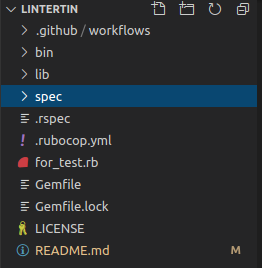

<h1 align="center">Lintertin</h1>

> This is a simple Ruby linter, used to improve code quality and readability.

You're working with Ruby and not sure what the best practices are?? **Lintertin** will help you. You can test a single file, and also you can test all the files that exist in the root directory by using this linter.

## Documentation

- [Built With](#built-with)
- [Getting Started](#getting-started)
  - [Prerequisites](#prerequisites)
  - [Setup](#setup)
  - [Install](#install)
  - [Usage](#usage)
  - [Run tests](#run-tests)
- [Good and Bad examples](#good-and-bad-examples)
  - [Trailing spaces](#trailing-spaces)
  - [Correct indentation](#correct-indentation)
  - [Empty lines](#empty-lines)
  - [Single empty line at the bottom of the file](#single-empty-line-at-the-bottom-of-the-file)
  - [Braces, brackets and parenthesis](#braces,-brackets-and-parenthesis)
    - [Parenthesis](#parenthesis)
    - [Braces](#braces)
    - [Brackets](#brackets)
  - [Pipes |](#pipes-|)
    - [Spaces before or after the pipe](#spaces-before-or-after-the-pipe)
    - [Missing pipe](#missing-pipe)
  - [End keyword](#end-keyword)
    - [Missing end](#missing-end)
    - [Extra end](#extra-end)
- [Author](#author)
- [🤝 Contributing](#🤝-contributing)
- [Show your support](#show-your-support)
- [Acknowledgments](#acknowledgments)
  - [📝 License](#📝-license)

## Built With

- Ruby
- Rubocop: as a linter
- RSpec: as a tester

## Getting Started

To get a local copy up and running follow these simple example steps.

### Prerequisites

You should have [Ruby](https://www.ruby-lang.org/en/documentation/installation/) installed on your machine.

### Setup

Open your terminal, type `git clone https://github.com/martinnajjar12/lintertin.git` and hit Enter to download this repository.

### Install

- At first, make sure that you have `bundler` installed on your machine. Again in your terminal type the command `bundler -v`. If a version showed up, skip the next step, if not please continue.
- Type the command `gem install bundler` and hit Enter to install bundler on your machine.
- Now you're ready to start! Type in your terminal `bundle install` to get the required dependencies to run this linter.

### Usage

Follow these steps to scan your files:

- Clone this repository as explained [here](#setup)
- Put the files you want to scan in the root directory of this project as shown below (like `for_test.rb` file):

  

- Now you can simply run the command `bin/lintertin` in your terminal to check all the Ruby files that exist in the root directory, or `bin/lintertin <the name of the file you want to scan>` if you want to scan a specific file.

### Run tests

You can test the project with RSpec! Simply type `rspec` in your terminal to see the test results. Make sure to do this step after completing [the install section](#install)

## Good and Bad examples

Take a look at the cops Lintertin warn you about:

### Trailing spaces

<p>Lintertin checks if there is a trailing space at the end of the line:</p>

Bad Example:

```Bad Example
class ForTest
  'def method   '
  end
end

```

Good Example

```Good Example
class ForTest
  'def method'
  end
end

```

### Correct indentation

<p>Lintertin checks if the lines are correctly indented:</p>

Bad Example:

```Bad Example
class ForTest
def method
  end
end

```

Good Example

```Good Example
class ForTest
  def method
  end
end

```

### Empty lines

<p>Lintertin checks if there's an unwanted empty line after a certain keyword:</p>

Bad Example:

```Bad Example
class ForTest

  def method
  end
end

```

Good Example

```Good Example
class ForTest
  def method
  end
end

```

### Single empty line at the bottom of the file

<p>Lintertin checks if there's no empty line at the end of the file:</p>

Bad Example:

```Bad Example
class ForTest
  def method
  end
end
```

Good Example

```Good Example
class ForTest
  def method
  end
end

```

### Braces, brackets and parenthesis

Consider the following examples:

#### Parenthesis

<p>Lintertin checks if there is a missing parenthesis:</p>

Bad Example:

```Bad Example
class ForTest
  def method(param
  end
end

```

Good Example

```Good Example
class ForTest
  def method(param)
  end
end

```

#### Braces

<p>Lintertin checks if there is a missing curly brace:</p>

Bad Example:

```Bad Example
class ForTest
  def method(array)
    array.each { |n| puts n
  end
end

```

Good Example

```Good Example
class ForTest
  def method(array)
    array.each { |n| puts n }
  end
end

```

#### Brackets

<p>Lintertin checks if there is a missing bracket:</p>

Bad Example:

```Bad Example
class ForTest
  def method(array)
    puts array[3
  end
end

```

Good Example

```Good Example
class ForTest
  def method(array)
    puts array[3]
  end
end

```

### Pipes |

Lintertin checks if the file has a missing pipe or a space before or after the pipe.

#### Spaces before or after the pipe

<p>Lintertin checks if there is an unwanted space before or after the pipe:</p>

Bad Example:

```Bad Example
class ForTest
  def method(array)
    array.each do |elem |
    end
  end
end

```

Good Example

```Good Example
class ForTest
  def method(array)
    array.each do |elem|
    end
  end
end

```

#### Missing pipe

<p>Lintertin checks if there is a missing pipe:</p>

Bad Example:

```Bad Example
class ForTest
  def method(array)
    array.each do |elem
    end
  end
end

```

Good Example

```Good Example
class ForTest
  def method(array)
    array.each do |elem|
    end
  end
end

```

**Warning:** If there's a space before or after the pipe, then it will not check for a missing one.

### End keyword

Lintertin checks if there's a missing `end` or an extra `end`:

#### Missing end

Lintertin checks if there's a missing `end`:

<p>Bad Example</p>

```Bad Example
class ForTest
  def method
end

```

Good Example

```Good Example
class ForTest
  def method
  end
end

```

#### Extra end

Lintertin also checks if there's an extra `end`:

<p>Bad Example</p>

```Bad Example
class ForTest
  def method
  end
end
end

```

Good Example

```Good Example
class ForTest
  def method
  end
end

```

**Warning:** This linter doesn't work with the inline `if` and inline `unless`!! For instance:

```
return 'something' if I'm_true\n
```

```
return 'something' unless I'm_true
```

## Author

👤 **Martin Najjar**

- GitHub: [Martin Najjar](https://github.com/martinnajjar12)
- Twitter: [Martin Najjar](https://twitter.com/martin_najjar)
- LinkedIn: [Martin Najjar](https://linkedin.com/in/martinnajjar12)

## 🤝 Contributing

Contributions, issues, and feature requests are welcome!

Feel free to check the [issues page](https://github.com/martinnajjar12/lintertin/issues/).

## Show your support

Give a ⭐️ if you like this project!

## Acknowledgments

- Built as a capstone project for Ruby section in [Microverse](https://www.microverse.org/)
- Inspired by the idea of [Rubocop](https://docs.rubocop.org/rubocop/index.html)

### 📝 License

This project is [MIT](https://github.com/martinnajjar12/lintertin/blob/development/LICENSE) licensed.
